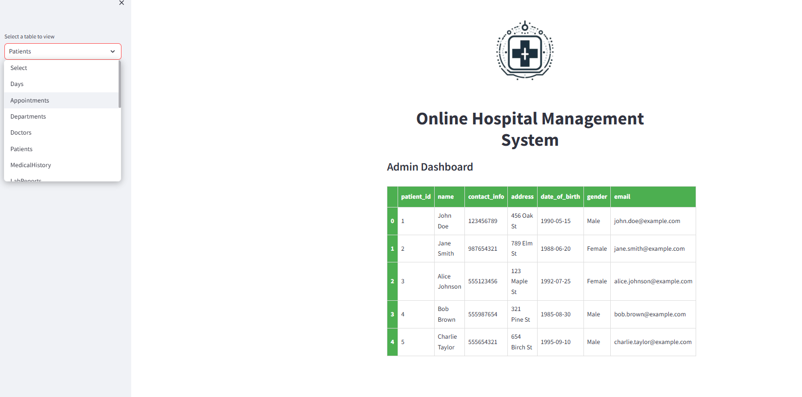

# 🏥 Online Hospital Management System - Admin Dashboard

This is a **Streamlit-based Admin Dashboard** for managing and viewing various components of a hospital management system. The application interfaces with an SQLite database to display information from different hospital-related tables in a clean and user-friendly web app.

> 🧪 **Note:** This project was developed as part of my **Software Engineering Lab** coursework.

---

## 🚀 Features

- Displays real-time data from multiple hospital management tables
- Interactive UI with sidebar navigation to choose tables
- Centered branding/logo and styled headers
- Responsive and neatly styled tabular views using HTML/CSS in Streamlit
- Securely connects to SQLite database (`online_hospital_management_system.db`)

---

## 📊 Tables Included

The dashboard allows the admin to view data from the following tables:

- Days  
- Appointments  
- Departments  
- Doctors  
- Patients  
- MedicalHistory  
- LabReports  
- Prescriptions  
- TreatmentPlans  
- ProgressTracking  
- Billing  
- Staff  
- Schedules  
- Payroll  
- Medications  
- Suppliers  
- Inventory  
- Orders  

---

## 🛠 Tech Stack

- **Frontend**: [Streamlit](https://streamlit.io/)
- **Backend/Database**: SQLite3
- **Data Handling**: Pandas
- **Language**: Python 3

---

## ▶️ How to Run

1. **Clone the repository** or copy the script and assets.

2. **Install required dependencies**:
   ```bash
   pip install streamlit pandas
   ```

3. **Run the application**:
   ```bash
   streamlit run main.py
   ```

4. **Access the dashboard** at `http://localhost:8501` in your web browser.

---

## 📋 Prerequisites

- Python 3.7 or higher
- SQLite3 (usually comes with Python)
- Required Python packages: `streamlit`, `pandas`, `sqlite3`

---

## 🗄️ Database Setup

Ensure you have the `online_hospital_management_system.db` file in the same directory as `app.py`. The database should contain the tables listed in the "Tables Included" section above.

---

## 📸 Preview



---
